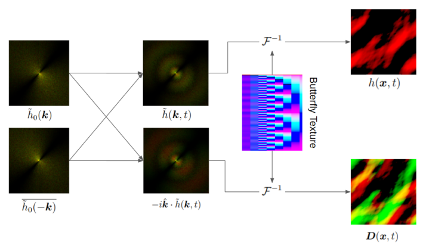
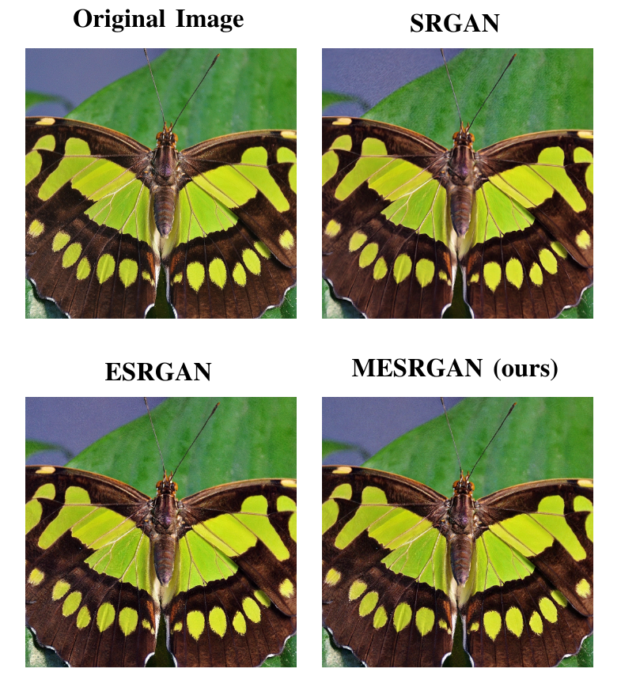
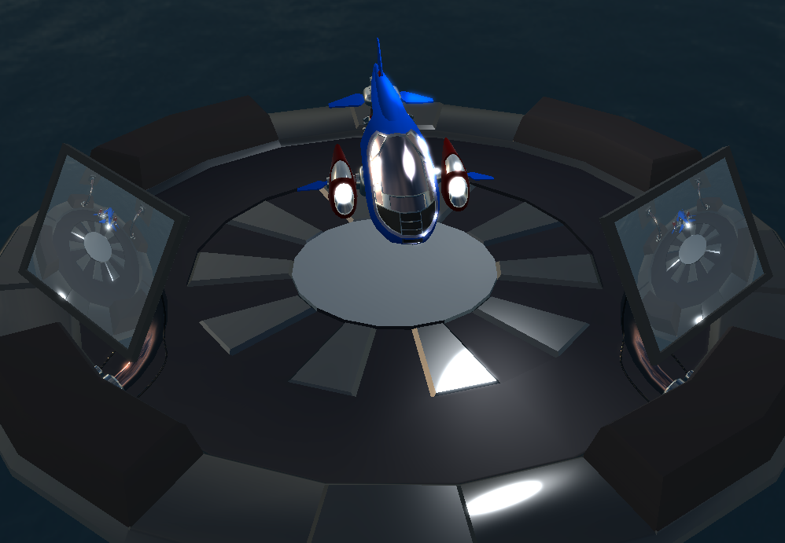

# Portfolio

Hello, my name is Jacob Eriksson ([LinkedIn](https://www.linkedin.com/in/jacob-a-eriksson/), [GitHub](https://github.com/NeonSky)).

This is my portfolio of visual computing projects that I have worked on.
The projects are sorted by relevance, with the most relevant projects at the top, and the bottom containing projects dating back to 2014.
The title of each project links to further details, which usually implies source code (unless the project is closed-source), reports, or demos.

&nbsp;
## [Vulkan Renderer](https://github.com/NeonSky/vulkan-renderer)

Hobby 3D rendering engine written in Rust and Vulkan (Ash bindings).
Used as a personal workbench for exploring various topics and ideas related to 3D Computer Graphics (3DCG) and the Vulkan API.
It uses a render graph design for recording command buffers, an ECS design for managing objects in a scene, and Dear ImGui for the GUI.

This project is currently under active development.
Once it becomes publicly available, I would strongly recommend checking out the project's [README](https://github.com/NeonSky/vulkan-renderer) for further details, visuals, and a list of supported features.
For now though, I would recommend reaching out to me personally for any questions.

&nbsp;
## [Improving the Accuracy of FFT-based GPGPU Ocean Surface Simulations](https://github.com/NeonSky/master-thesis)

Master's thesis in computer science and engineering.
A paper that demonstrates how latency-induced simulation errors, present in current state-of-the-art real-time interactive ocean simulations (due to asynchronous GPU readbacks), can be avoided without hurting performance.
From investigating the state of the art, we found that the latency-induced simulation errors could negatively affect the long-term state of simulation by significant degrees.
The framework that we propose to solve this issue integrates all parts of the simulation (ocean, wakes, and boats) on the GPU, effectively avoiding readbacks all together.

A prototype of our proposed framework was implemented in Unreal Engine 4.26, mainly using C++14 and HLSL-based custom compute shaders.
All shaders were written to utilize the new Render Dependency Graph (RDG) and the Vulkan API was used as the backend.
Additionally, Python was used for report-related data analysis and a C#/Unity project was built to measure the delays of asynchronous readbacks.

The simulation itself is quite math-heavy and utilizes Digital Signal Processors (DSP) theory to a great extent in order to derive the Fourier transforms needed to continously convert the ocean between frequency space (for efficient animation) and world space (for user perception).

&nbsp;
## [IPEX Viewer](https://www.ikea.com/se/sv/planners/)

IPEX Viewer is a WebGL renderer that is used to provide web-based interactive 3D planning tools at IKEA, more specifically the IKEA Planning Experience Programme (IPEX).
I worked on this project for 3 months while doing a paid summer internship at Rapid Images in Gothenburg.
My main contributions include: the design and implementation of real-time and offline soft shadows, improved anti-aliasing on multiple platforms, the introduction of a LOD system, and performance profiling in areas such as light baking.
The explored anti-aliasing options were: FXAA, MSAA, SSAA, and TAA.

Mainly worked with WebGL, GLSL, BabylonJS, TypeScript, and glTF.

&nbsp;
## [MESRGAN: Mobile Enhanced Super-Resolution Generative Adversarial Network](https://github.com/NeonSky/computer-vision-MESRGAN)

MESRGAN is a computer vision paper and project that explores potential performance improvements to ESRGAN, a deep learning model for generating super-resolution images.
The proposed idea was to incorporate bottleneck layers from MobilenetV2 into ESRGAN, which would theoretically halve the overall computational cost, and thereby accelerate model training.
In practice, MESRGAN maintained equivalent accuracy to ESRGAN, despite needing fewer computations.
However, we also found that the changes introduced in MESRGAN did not accelerate training, and proceeded with tracking down the reason why.
The culprit ended up being a limitation in the PyTorch library.

&nbsp;
## [CityCraft: Procedural Generation of Modern 3D Cities](https://github.com/DATX02-20-02)

Bachelor's thesis in computer science and engineering.
A paper that investigates how techniques in Procedural Content Generation (PCG) can be combined with computer graphics theory to generate digital 3D cities.
The resulting application allows for interactive generation of city models that can then be serialized and exported as glTF models.
The city generation is split into many stages that each explore a suite of PCG techniques, e.g. Agent-based generation, L-systems, Poisson-disc sampling, and gradient noise.

The application is written in C# using the Unity game engine.
GitHub Actions and Docker are used for CI, while dotnet-format is used to automatically format and lint the codebase.

&nbsp;
## [DAT205: Advanced Computer Graphics Course Project](https://github.com/NeonSky/dat205)

DAT205 is a course project where I decided to implement a 3D pong game and an SPH-based (smoothed-particle hydrodynamics) fluid simulation that are both rendered using real-time PBR-based ray tracing. 
The pong game is primarily focused on light transport phenomena, such as soft shadows, transparency, refractions, and reflections.
The fluid simulation is quite mathematical in nature and is largely based on the paper [Lagrangian Fluid Dynamics
Using Smoothed Particle Hydrodynamics](http://image.diku.dk/projects/media/kelager.06.pdf) by Micky Kelager.

The two applications are written in C++11, OpenGL/GLSL, NVIDIA OptiX 5, and CUDA 9.

&nbsp;
## [Neon Engine](https://github.com/NeonSky/neon-engine)

Neon Engine is a simple multi-window game engine written in C++17 and OpenGL that has a focus on CI and documentation.
The engine relates objects in each scene with a scene hierarchy, such that children inherit the transform of their parents.
Among other things, this feature makes it simple to combine colored cubes into a (solvable) Rubik's cube.
This scene hierarchy is combined with an ECS design so that arbitrary components can easily be attached to and detached from arbitrary objects (i.e. entities).

The GoogleTest framework is used to write and run test, while Docker and Travis CI are used to automate the execution of these tests.
Documentation is written in the Doxygen format, which is then compiled to both Doxygen and Sphinx (through Breathe and Exhale) HTML-based API documentations.
Clang-Format and Clang-Tidy and are used to format and automatically lint the code, respectively.

Other notable tools include: EnTT for the ECS architecture, CMake for the build system, and Vcpkg for library dependencies.

&nbsp;
## [Open Pokémon TCG](https://github.com/NeonSky/open-pokemon-tcg)

Open Pokémon TCG is a digital clone of the Pokémon trading card game (TCG) written in C++17 and OpenGL/GLSL.
The application follows a layered architecture where one layer handles all data, one layer models all (business/game) logic concerning this data, one layer handles the visual representations of these models, and one layer manages the application's interaction with user input.

The application uses CMake for its build system, Vcpkg for most of its library dependencies, Dear ImGui for its GUI, and GLFW for window management.
All card images and attributes are fetched during runtime from [pokemontcg.io](https://pokemontcg.io/) through HTTP, and then cached locally.

&nbsp;
## [TDA362: Computer Graphics Course Project](http://www.cse.chalmers.se/edu/course/TDA362/index.html)

TDA362 is a computer graphics course project mainly concerned with physically based rendering (PBR) and coarsely covering a broad spectrum of other of other rendering topics (e.g. post-processing, particle effects, and shadow maps).
I have also worked as paid teaching assistant in this course.

The project is written in C++11, OpenGL, and GLSL.
The build system is primarily based on CMake.

&nbsp;
## [Troll Tower](https://drive.google.com/drive/folders/1R0v9Z-mSdFVamZNgrsYBIbHoCkct7902)

> A brave purple knight is climbing up a tower that is controlled by the evil troll king in order to save his knightly brethren and put an end to the king's regime.
> Along the way up the tower, the knight finds various treasures, spells, and weapons to help him on his journey, as well as some friendly fellows.

Troll Tower is a 2D action-platform game where the goal of every level is to find the door to the next floor.
Each floor is filled with treasures, traps, merchants, and of course troll-themed enemies!
Each floor is procedurally generated and they increase in difficulty as the player advances further up the tower.
The tower floors are divided into several zones with different themes and each zone ends with a randomly selected boss fight.

The game is written in C# using the Unity game engine.

&nbsp;
## [DrawSession](https://www.youtube.com/watch?v=BU1cc7htIbU)

DrawSession is a web application where users can create whiteboard sessions and draw together in real-time. The application is written in ReactJS, React Redux, and NodeJS.
The website was hosted on AWS for development and on DigitalOcean for production. Payments were handled through PayPal.

&nbsp;
## [Various Old Game Projects](https://jacob7798.itch.io/)

Three games written in C# using the Unity game engine:
- Geometric Tower Defense is a tower defense game with an online leaderboard that was backed by a MySQL database (through my personal website).
- Disc Fighters is a local co-op twin stick shooter where your aim automatically rotates around you to the beat of the music and where discs (bullets) bounce on walls.
- Green and Blue is a puzzle platformer where the fabric of space is split into two non-interacting colors. Developed and submitted as an entry to Ludum Dare 32, where it received decent scores and pleasant reviews.

